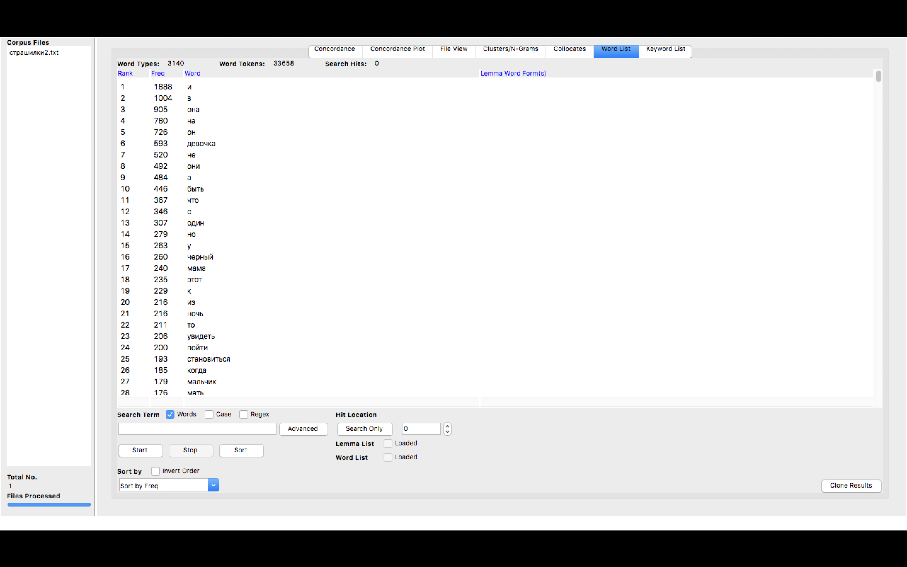
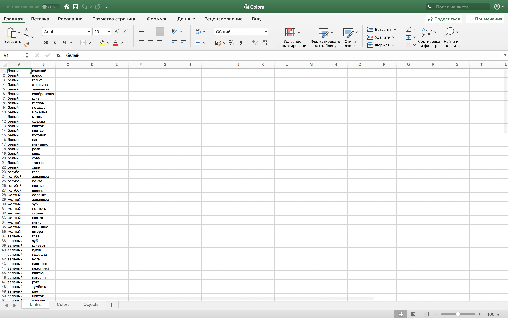
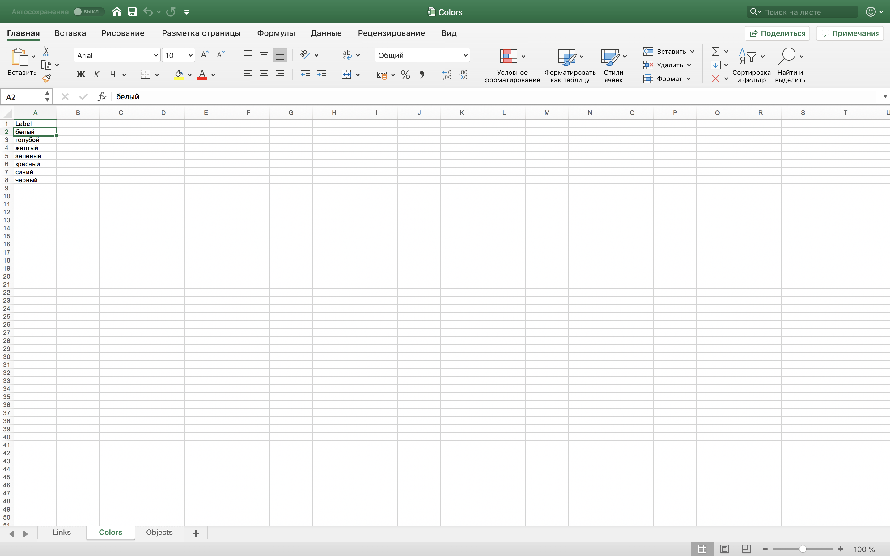
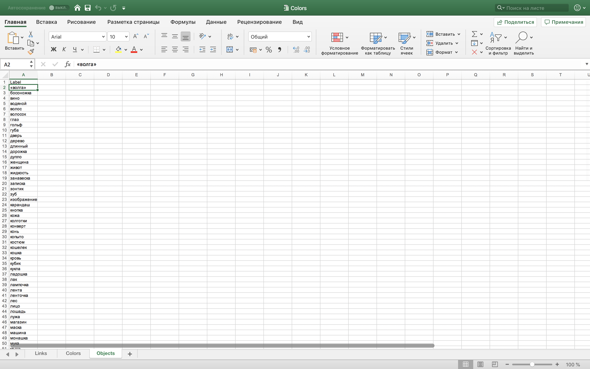
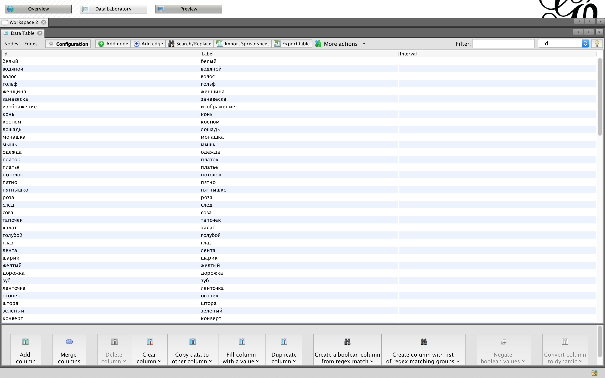
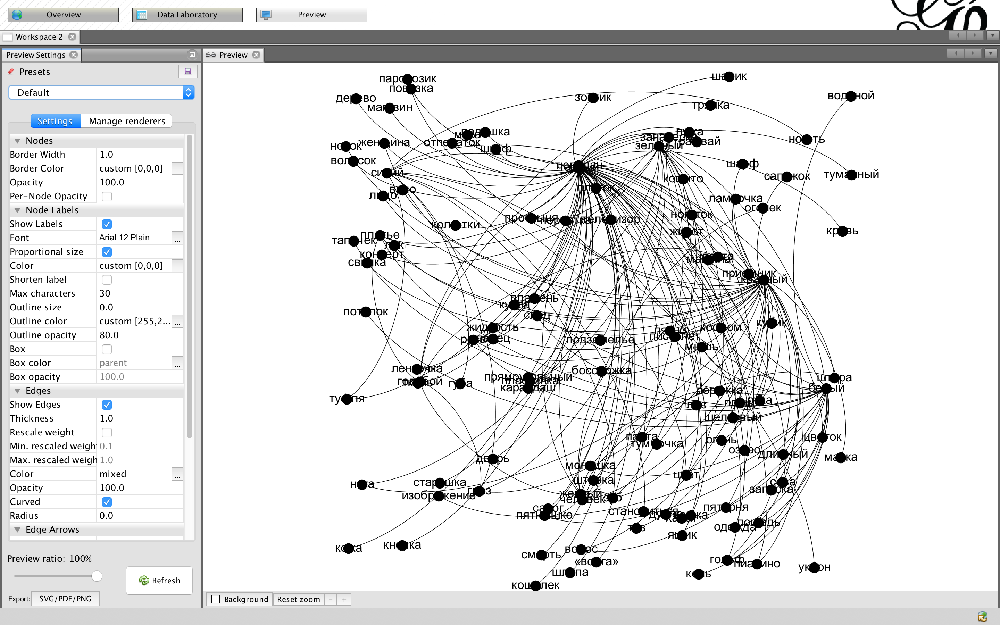

# Анализ цвета в детских страшилках

Наше исследование происходит на основе корпуса детских страшилок— внушительной части детского городского фольклора. Сегодняшние осколки культуры детского фольклора у детей старшего возраста происходят из СССР с его возможностями в виде детских лагерей, так что и корпус наших страшилок будет советский. Материал исследования — собрание страшилок на электронном ресурсе (https://www.e-reading.club/bookreader.php/81958/Detsk..). Цель исследования — изучить основную палитру цветов в корпусе и выявить наиболее частотные цвета и коллокации слов вокруг них.

1. Мы лемматизируем текст через Mystem для последующей работы с лексикой.

2. Мы загружаем корпус текстов в AntConc. 

В настройках мы настраиваем токены, добавляем dash и connector. 

Рассматриваем кластеры цветов. 

Черный цвет

Красный цвет

Белый цвет

Синий цвет

Зеленый цвет

Желтый цвет

Голубой цвет

3. Далее мы создаём три страницы в Excel: links, colours и objects. 

4. Открываем Gephi и загружаем таблицы.

5. Получаем график.

Вывод: в детских страшилках достаточно ограниченная палитра цветов. Всего их получаем семь: чёрный, красный, белый, синий, зел\ный, жёлтый и голубой. Все цвета обозначают примерно одни и те же предметы-маркеры страшилок. При этом, наиболее частотными цветами в детских страшилках являются чёрный и красный как ассоциирующиеся со смертью и кровью, остальные цвета используются для разнообразия и не несут в себе никакой коннотативной ценности для повествования.

